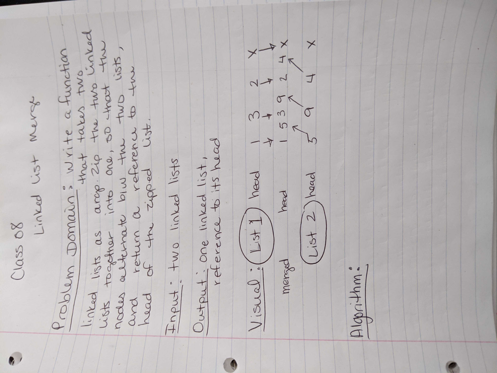

# Merge Code Challenges

## Merge 

### Challenge
- Write a function which takes two linked lists as arguments. Zip the two linked lists together into one so that the nodes alternate between the two lists and return a reference to the head of the zipped list.

### Approach & Efficiency
- 
- ??? Start with listOne, taking first node from it and appending it to the newList, then pointing it to the first node from listTwo, then pointing that one back to listOne's second node

- Return a new list with contents of the merged lists

### Solution
