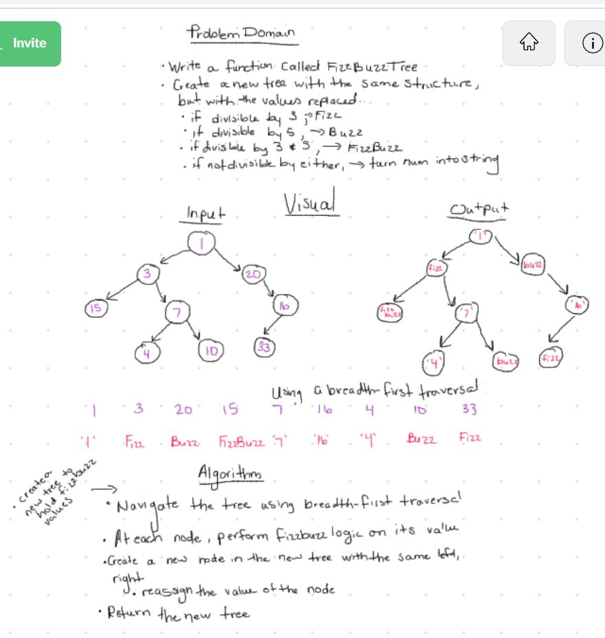

# FizzBuzz Tree

### Challenge

- Write a function called FizzBuzzTree which takes a k-ary tree as an argument.
- Create a new tree with the same structure as the original, but the values modified as follows:
  - If the value is divisible by 3, replace the value with “Fizz”
  - If the value is divisible by 5, replace the value with “Buzz”
  - If the value is divisible by 3 and 5, replace the value with “FizzBuzz”
  - If the value is not divisible by 3 or 5, simply turn the number into a String.
- Return a new tree.

### Approach & Efficiency
- O(n) - time and space. traverses the entire tree, but also makes a new one of the same size. as the trees grow, so does the efficiency
- See solution below - NOTE: made an adjustment to use preOrder traversal rather than breadth first. 

### Solution
