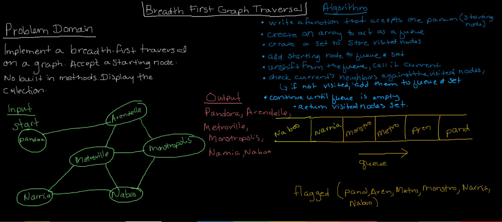
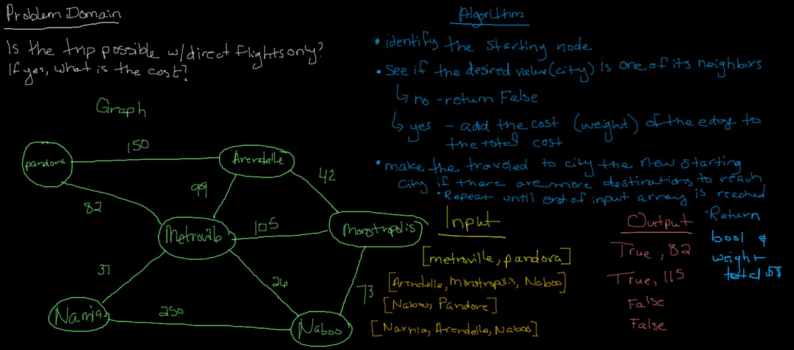

# Graphs

## Implement Graph

### Challenge 

The graph should be represented as an adjacency list, and should include the following methods:

- AddNode // addVertex( )
  - Adds a new node to the graph
  - Takes in the value of that node
  - Returns the added node

- AddEdge // addEdge( )
  - Adds a new edge between two nodes in the graph
  - Include the ability to have a “weight”
  - Takes in the two nodes to be connected by the edge
  - Both nodes should already be in the Graph

- GetNodes // getNodes( )
  - Returns all of the nodes in the graph as a collection (set, list, or similar)

- GetNeighbors // getNeighbors( )
  - Returns a collection of edges connected to the given node
  - Takes in a given node
  - Include the weight of the connection in the returned collection

- Size // size( )
  - Returns the total number of nodes in the graph

### Approach & Efficiency
Using an adjacency list
- Storage O(vertices + edges)
- addVertex - O(1) , addEdge - O(1)

## Breadth First Graph Traversal

### Challenge 

Implement a breadth-first traversal on a graph.

- Accepts a starting node
- Without utilizing any of the built-in methods available to your language
- Returns a collection of nodes in the order they were visited
- Displays the collection

### Approach & Efficiency

- Time: O(V + E) - using an adjacency list. We need to check every vertex that is attached by an edge, and compare to what has already been seen. This could mean we see all of the edges and vertices more than once, or perhaps not all all. Worst case, we see them all multiple times. 
-  Space: O(Log n), we create a new queue and a new set, which initially takes up space, but it doesn't grow too quickly even when we visit nodes and edges multiple times.

### Solution

##  Get Edge

### Challenge
- Given a business trip itinerary, and an Alaska Airlines route map, is the trip possible with direct flights? If so, how much will the total trip cost be?
- Write a function which takes in a graph, and an array of city names
- Without utilizing any of the built-in methods available to your language
- Return whether the full trip is possible with direct flights, and how much it would cost

### Approach & Efficiency
- TIME complexity: 
- SPACE complexity: 

### Solution

## Depth First PreOrder

### Challenge 
- Conduct a depth first preorder traversal on a graph
- Create a function that accepts an adjacency list as a graph
- Conducts a depth first traversal
- Without utilizing any of the built-in methods available to your language
- Return a collection of nodes in their pre-order depth-first traversal order

### Approach & Efficiency
- TIME complexity: 
- SPACE complexity: 

### Solution
