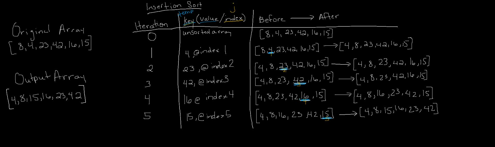

# Insertion Sort

## Insertion Sort

### Challenge: Review the pseudocode, trace the algorithm by stepping through the process with the provided sample array. Document your explanation that shows the step-by-step output after each iteration through some sort of visual. Code a working, tested implementation of Insertion Sort.

    InsertionSort(int[] arr)
    
      FOR i = 1 to arr.length
      
        int j <-- i - 1
        int temp <-- arr[i]
        
        WHILE j >= 0 AND temp < arr[j]
          arr[j + 1] <-- arr[j]
          j <-- j - 1
          
        arr[j + 1] <-- temp

### Approach & Efficiency
- TIME: Insertion sort runs in O(n²), or quadratic, time in the worst case. This typically isn’t very effective and should not be used for large lists. Because of insertion sort’s low hidden constant value, however, it usually outperforms more advanced algorithms such as quick sort or merge sort on smaller lists. [JS Algorithms blog](https://medium.com/javascript-algorithms/javascript-algorithms-insertion-sort-59b6b655373c)
- SPACE: Because insertion sort sorts your list in-place, it only uses O(1) (constant) space. [JS Algorithms blog](https://medium.com/javascript-algorithms/javascript-algorithms-insertion-sort-59b6b655373c)

### Solution

#### Resources 
- [JS Algorithms blog](https://medium.com/javascript-algorithms/javascript-algorithms-insertion-sort-59b6b655373c)