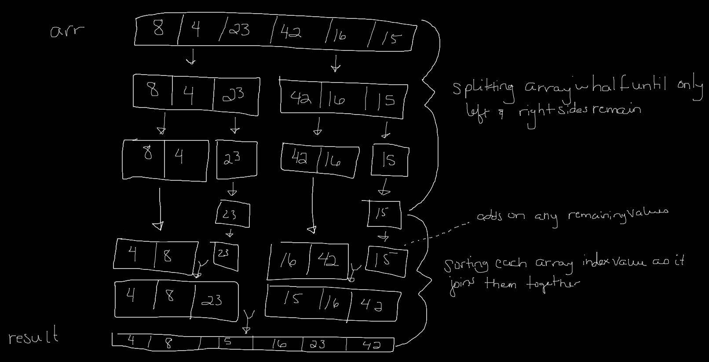

# Merge Sort

##  Merge Sort

### Challenge: Review the pseudocode, trace the algorithm by stepping through the process with the provided sample array. Document your explanation that shows the step-by-step output after each iteration through some sort of visual. Code a working, tested implementation of Merge Sort

    ALGORITHM Mergesort(arr)
        DECLARE n <-- arr.length
              
        if n > 1
          DECLARE mid <-- n/2
          DECLARE left <-- arr[0...mid]
          DECLARE right <-- arr[mid...n]
          // sort the left side
          Mergesort(left)
          // sort the right side
          Mergesort(right)
          // merge the sorted left and right sides together
          Merge(left, right, arr)

    ALGORITHM Merge(left, right, arr)
        DECLARE i <-- 0
        DECLARE j <-- 0
        DECLARE k <-- 0

        while i < left.length && j < right.length
            if left[i] <= right[j]
                arr[k] <-- left[i]
                i <-- i + 1
            else
                arr[k] <-- right[j]
                j <-- j + 1
                
            k <-- k + 1

        if i = left.length
          set remaining entries in arr to remaining values in right
        else
          set remaining entries in arr to remaining values in left

### Approach & Efficiency
- O(1)? etc
- 

### Solution

#### Resources
- [Merge Sort - Tim Han](https://medium.com/javascript-in-plain-english/javascript-merge-sort-3205891ac060)