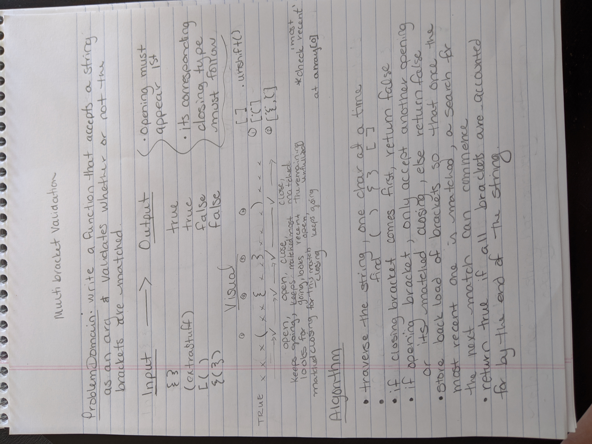
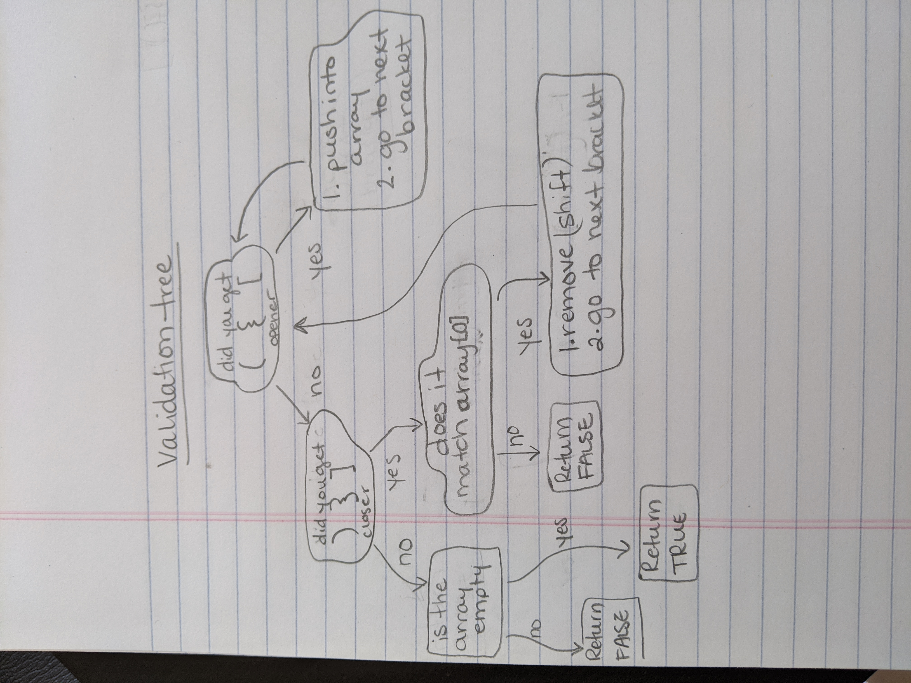

# Multi Bracket Validation

## Multi Bracket Validation

### Write a function called multiBracketValidation() 

- takes in a string as its only argument
- returns a boolean representing whether or not the brackets in the string are balanced (each opener must be closed by its own matching closer)
- consider `()`, `[]`, and `{}`

### Approach & Efficiency
- O(n)
- creates only 1 array, adding and removing values as they are encountered

### Note
- At first, I tried to next `if` statements within `if` statements.This caused issues. Then, using `&&` operators was able to achieve the goal.
- **Note To Self** : Two `yes` in a row on the flow chart? Link them together with `&&` in one single `if` statement.

### Solution

