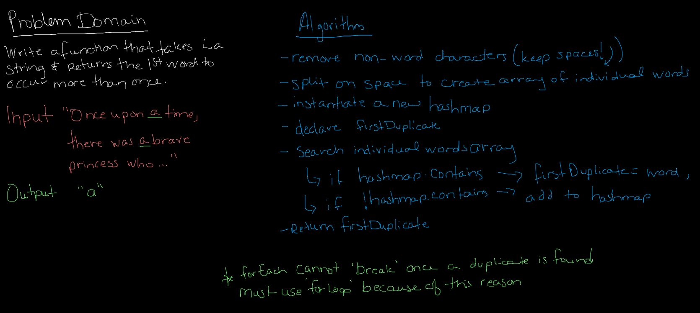

# Repeated Word

##  Repeated Word

### Challenge: Write a function that accepts a string and returns the first word to occur more than once. 
- Accepts a lengthy string parameter
- Return the first word to occur more than once in that provided string
- Use no built-in library methods available to your language

### Approach & Efficiency
- TIME complexity: O(n) - could go through all words in string
- SPACE complexity: O(log2n) - creates a hashTable and an extra array to hold string 

### Solution

### Resources
- [medium blog post](https://medium.com/front-end-weekly/3-things-you-didnt-know-about-the-foreach-loop-in-js-ff02cec465b1);
- [regex101](https://regex101.com/)