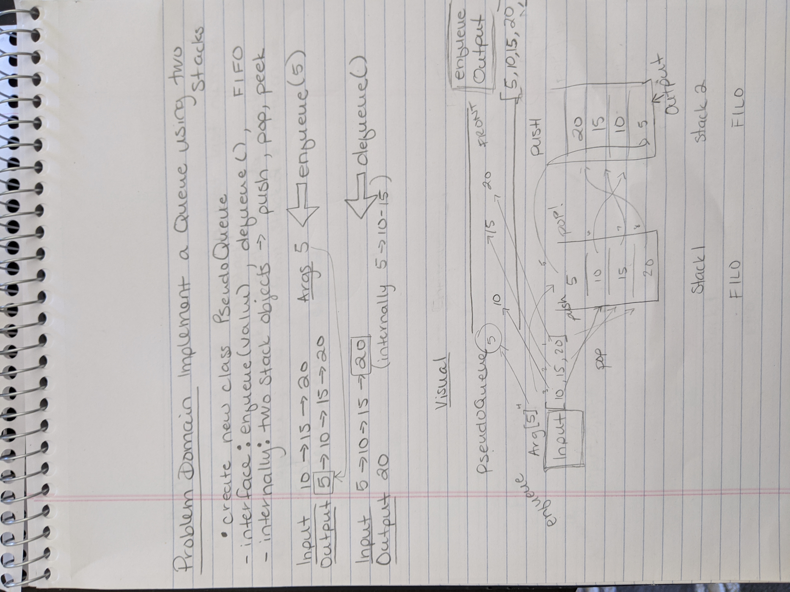
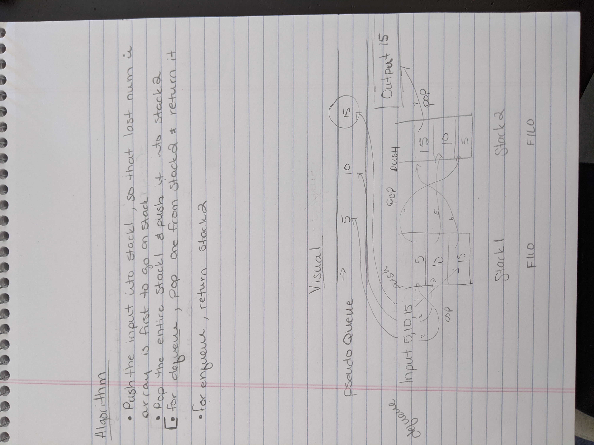

# Stacks and Queues

## Stack and a Queue Implementation

### Implement the following:
- [x] Create a Node class
- Create the following for each:
- [x] Stack class
  1. [x] define the top
  2. [x] push
  3. [x] pop
  4. [x] peek
  5. [x] isEmpty
- [x] Queue class
  1. [x] define the front 
  2. [x] enqueue
  3. [x] dequeue
  4. [x] peek
  5. [x] isEmpty

### Efficiency
- O(1) linear time -push, enqueue, dequeue, pop, peek, isEmpty

### Solution

 

## Queue with Stacks

### Implement a Queue using two Stacks

### Efficiency
- O(n)^2, exponential time, creates two new stacks
### Solution

#### Citations
- Alistair helped me with the visual, which helped me to better understand the concept and be able to write an algorithm and code
