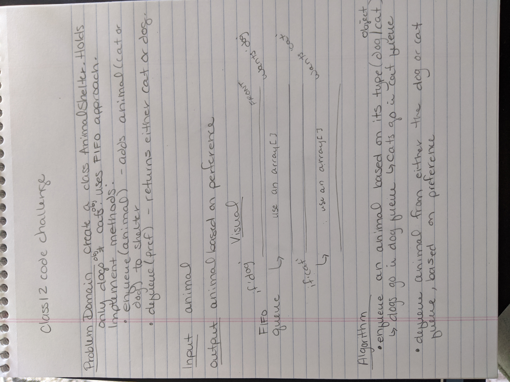

# FIFO - Animal Shelter

### Create a class called AnimalShelter which holds only dogs and cats, it uses FIFO approach. Implement the following methods:
- `enqueue(animal)` - add `animal` to the shelter, `animal` can be either dog or cat
- `dequeue(pref)` - returns either a dog or cat. If `pref` is not `'dog'` or `'cat'`, return null

### Approach & Efficiency
- Create two arrays, one for cats and one for dogs.
- Remove desired animal from index 0 of the preferred type's array
- O(n) proportional to the number of items

### Solution
