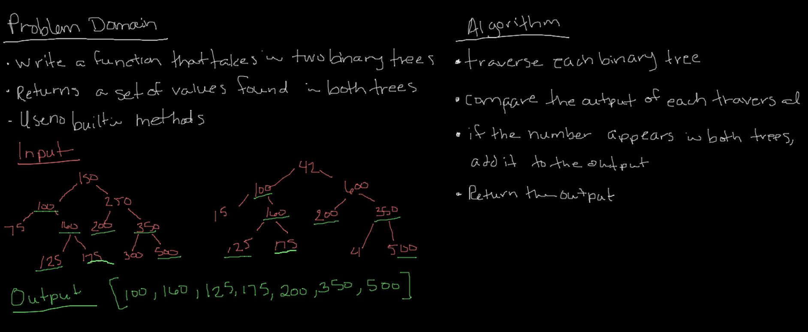

# Tree Intersection

## Tree Intersection

### Challenge: Find common values in 2 binary trees.
- Write a function called tree_intersection that takes two binary tree parameters
- Without utilizing any of the built-in library methods available to your language
- Return a set of values found in both trees.

### Approach & Efficiency
- TIME complexity: O(n+k) where n is a tree and k is a tree
- SPACE complexity: O(n), because a new object must be made to store all of tree one's values

      - create a function to take in two binary trees and return the intersections
      - traverse first tree and put it's values into an object {key: value} => {100: 100}
      traverse the second tree while checking if the value exists in the base comparision object (from treeOne)
      - if match, put in results array
      - return the array

### Solution

### Resources
