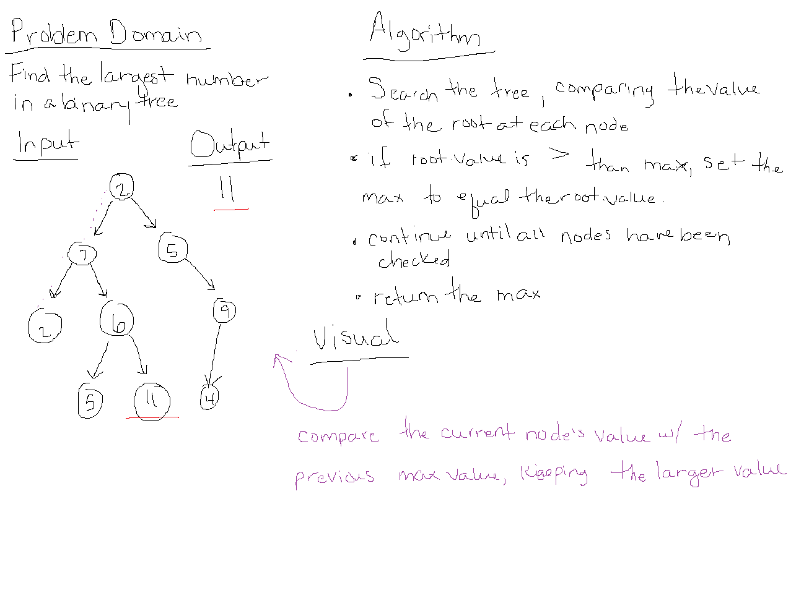

# Trees

##  Binary Search Tree class

### add & contains
Implmenent `add()` and `contains*()` methods on a binary search tree class

### Approach & Efficiency
- time complexity - O(h), where h is the height of the tree
- space complexity - O(1), since we are not allocating any additional space in a search

### Solution

#### References
- [InitJS](https://initjs.org/implement-a-binary-search-tree-in-javascript-952a44ee7c26) for `add()`

## Find Maximum in Binary Tree
Find the Maximum Value in a Binary Tree

### find-maximum-value
Write an instance method called `findMaximumValue()`, which returns the max value stored in the tree.
  - assume all values are numeric
  - use no built in methods

### Approach & Efficiency
- O(n) - time increases as the size of the tree grows
- O(1) - space, as only one variable is created to hold a number, and is reassigned throughout the function

### Solution

